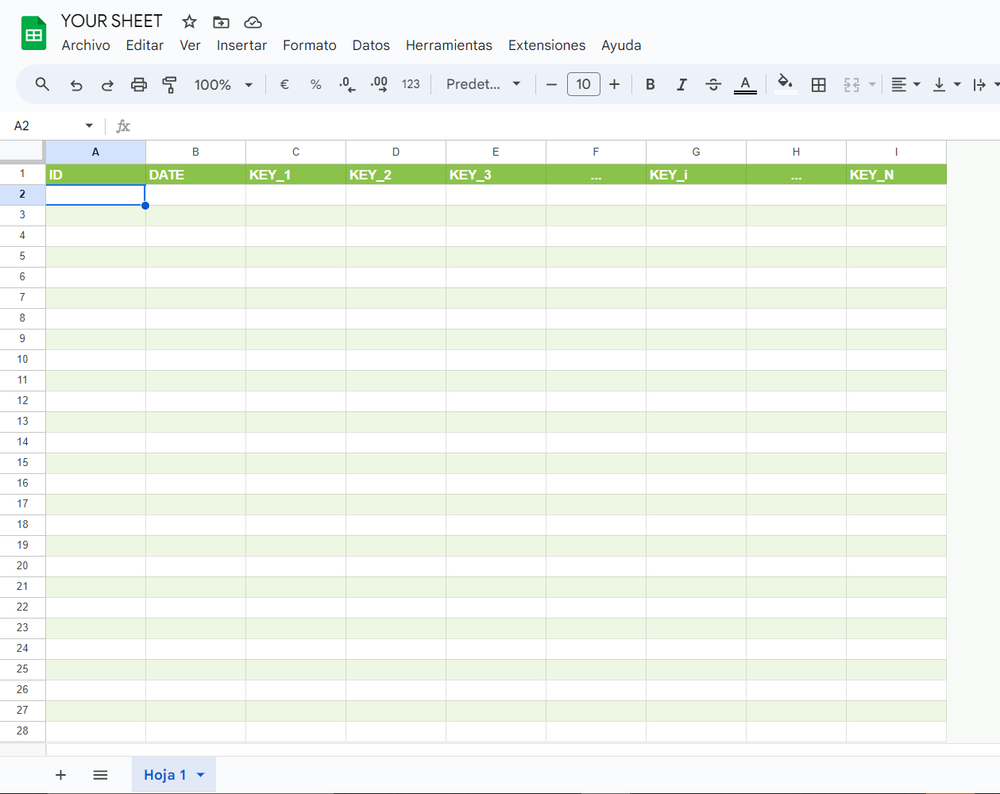

# Attention!!

Please refer to the Official Docs [here](https://docs.page/DanielZamb/crud-for-sheets~docs-testing) as they are being constantly updated. In the future this readme will only conatain **instalation** and **new features summary**.

# 📊 Google Apps Script CRUD Class for Google Sheets (v1.0.0)

Welcome to the **Google Apps Script CRUD Class for Google Sheets**! This library simplifies managing your Google Sheets as databases, allowing you to perform **Create, Read, Update,** and **Delete** (CRUD) operations with ease. Whether you're building a CRM, inventory system, or any data-driven application, this library has got you covered! 🚀


## 🌟 Features

- **✨ CRUD Operations**: Seamlessly Create, Read, Update, and Delete records in Google Sheets.
- **📜 History Tracking**: Automatically track deletions with history tables.
- **🔍 Sorting & Pagination**: Easily sort and paginate your data for better management.
- **✅ Type Validation**: Ensure data integrity with type checking (`number`, `string`, `boolean`, `date`).
- **📦 **New** Concurrency Locks**: Prevent race conditions with built-in locking mechanisms for writes and reads.
- **🔗 **New** Many-to-Many Relationship Support**: Handle complex data relationships using junction tables.
- **⚡️ Caching**: Improve performance with built-in caching mechanisms.
- **🎨 Customizable Color Schemes**: Beautify your sheets with predefined color themes.
- **🗃 **New** Bulk Reading**: Fetch multiple records by ID in a single call.

## 🎉 What's New in v1.0.0

1. **Concurrency Locks**
  - **Locking for Create/Update/Delete** operations to prevent concurrent writes on the same record.
  - New methods:
    - `releaseLocks()`: Frees all active locks held by this instance.
  - Automatically applied in `create`, `update`, and `remove`.

2. **Many-to-Many Relationship Support**
  - Easily create and manage **junction tables**.
  - New methods:
    - `createManyToManyTableConfig(config)`: Generates a ready-to-use table config for a junction (relation) table.
    - `createJunctionRecord(junctionTableName, data, keyOrder)`: Creates a new entry in the junction table.
    - `getJunctionRecords(junctionTableName, sourceTableName, targetTableName, sourceId, options)`: Returns related records from a junction.
    - `updateJunctionRecord(junctionTableName, id, data, keyOrder)`: Updates an existing record in the junction table.

3. **Cascade Deletion**
  - `removeWithCascade(tableName, historyTableName, id)`: Removes a parent record and automatically deletes or archives the related records from associated junction tables.

4. **Bulk Read**
  - `readIdList(tableName, ids)`: Allows you to read multiple records by their IDs in a single call.

5. **Integrity Checks**
  - `checkTableIntegrity(junctionTableName, junctionHistoryTableName)`: Scans a junction table for invalid foreign key references and moves them to history if the parent records no longer exist.

6. **Enhanced Logging & Debug**
  - Variants such as `createWithLogs()` and `updateWithLogs()` provide verbose logging to aid in debugging.

---

## 📦 Installation

**Copy the class found in CrudForSheets.js** 

*( i have yet to find out how to share a library publicly, when i do follow the steps bellow)*

------------------------------------------------------------------------------------------------------------------------------------------
1. **Open Google Apps Script Editor**:
   - Go to your Google Sheets.
   - Click on `Extensions` > `Apps Script`.

2. **Add the Library**:
   - In the Apps Script editor, click on the `+` icon next to `Libraries`.
   - Enter the Library ID: `1flBjZa3u09YAgozp3H-GEhkxpl61rbB2QW2SKnV7ZVlRHNhgxZydegDG`.
   - Select the latest version and add it to your project.

3. **Use the Library**:
   - You can now use the `DB` class from the library to manage your spreadsheets.


## 📚 Usage

### 🚀 Initialization

Initialize the database by creating a new instance of the `DB` class. You can either create a new spreadsheet or connect to an existing one using its ID.

```javascript
/**
 * Initialize the database.
 */

// Declare db in your global scope in order to use it in any part of the script
const db;
const existingDb;

function initializeDatabase() {
  // Initialize a new spreadsheet database
  db = DB.init('MyDatabase');

  // OR connect to an existing spreadsheet using its ID
  existingDb = DB.init('ExistingDatabase', 'YOUR_SPREADSHEET_ID');

  // Log the creation result
  console.log(db.getCreationResult());
}
```

### 🛠️ Creating Tables

Define and create tables within your spreadsheet. Each table represents a sheet with specified fields and types.

```javascript
/**
 * Create tables in the database.
 */
let tables = []
const db = DB.init('MyDatabase');
const employeeTableConfig;
const departmentTableConfig;

function createTables() {

  // Define configuration for the EMPLOYEES table
  employeeTableConfig = {
    tableName: "EMPLOYEES",
    historyTableName: "DELETED_EMPLOYEES",
    fields: {
      name: "string",
      age: "number",
      position: "string",
      employed: "boolean",
      hire_date: "date",
    }
  };

  // Create the EMPLOYEES table
  const createResult = db.createTable(employeeTableConfig);
  console.log("Employee table created:", createResult);

  // Define configuration for the DEPARTMENTS table
   departmentTableConfig = {
    tableName: "DEPARTMENTS",
    historyTableName: "DELETED_DEPARTMENTS",
    fields: {
      department_name: "string",
      manager_id: "number",
      location: "string",
    }
  };

  // Create the DEPARTMENTS table
  const deptCreateResult = db.createTable(departmentTableConfig);
  console.log("Departments table created:", deptCreateResult);

  tables.push(employeeTableConfig);
  tables.push(departmentTableConfig);
}
```

## Important Caveats for the following Section

### 1. Serialization when calling the backend
AppScript has a bit of a problem with serialization, and as this library attempts (poorly) to manage all the fields with js primitives, when you try to retrieve something from the backend, say a Date, it will not pass anything.

#### Example
Let's say you have the following Order table

```javascript
const orderTableConfig;

function initOrderTable(){
  orderTableConfig = {
    tableName: "ORDER",
    historyTableName: "DELETED_ORDER",
    fields : {
      transaction_id: "number",
      date_valid: "date",
      date_arrived: "date",
      completed: "boolean"
    }
  }

  db.createTable(orderTableConfig)
}

initOrderTable();
console.log(db.putTableIntoDbContext(orderTableConfig));

```

if you wanted to get all the records of the table
```javascript

google.script.run
            .withFailureHandler((err)=>{
              Swal.fire("Ups!", "Something went wrong: err "+ err.message, "error")
            })
            .withSuccessHandler((response)=>{
              console.log(response)
            }).readStuffFromTable()

```

In fact, it wont return anything. It will print out `null` or `undefined` in the console. The reason being that the GoogleAppsScript Serialization Engine doesn't know how to handle `Date()` types when returning them from a function call to the `.gs` file.

#### The workaround

Just return everything over a `JSON.stringify(record)`, and the de-serialize it in the client `JSON.parse(record)`.

The function then would look like this:

```javascript
google.script.run
            .withFailureHandler((err)=>{
              Swal.fire("Ups!", "Something went wrong: err "+ err.message, "error")
            })
            .withSuccessHandler((response)=>{
              response = JSON.parse(response)
              console.log(response)
              // { code: 200, message: [all yout data parsed]}
            }).readStuffFromTable()

```

And yes this is *inefficient*, it's prone to *errors* and if don't properly catch all the exceptions that your code throws, prepare to be seing this all time classic

```javascript
Uncaught SyntaxError: Unexpected token '}', "}" is not valid JSON
    at JSON.parse (<anonymous>)
    at <anonymous>:1:6
```
But hey, who did told you to use `javascript`? if you wanted type-safety, better error management and 0 bloat in your code, you should have known better.

#### My personal recomendation
Using javascript is purely a skill issue, git gud.

### 2. The way the tables are created

Whenever the library creates tables, it automatically includes two default columns at the beginning: **[ID, DATE]**. The library *expects* that any table included in the schema context **also** begins with these two columns in the sheet.

So, *your sheet* should look like this:



#### Why, you ask?

Well, i found those 2 fields to be pretty useful when using any of the CRUD operations on any table i was making, so i just put them as the default columns on every creation.

#### The important Bit ❗❗

As those fields are the default and are **expected** you **DO NOT** have to declare them when creating the *tableConfig* objects. 

Bad *tableConfig*:
```javascript
orderTableConfig = {
    tableName: "ORDER",
    historyTableName: "DELETED_ORDER",
    fields : {
      id: "number", //shouldn't be here
      date: "date", //shouldn't be here
      transaction_id: "number",
      date_valid: "date",
      date_arrived: "date",
      completed: "boolean"
    }
  }

```

Expected *tableConfig*
```javascript
orderTableConfig = {
    tableName: "ORDER",
    historyTableName: "DELETED_ORDER",
    fields : {
      transaction_id: "number",
      date_valid: "date",
      date_arrived: "date",
      completed: "boolean"
    }
  }

```

### 3. Beware of the Headers

As mentioned, the library expects the **[ID, DATE]** fields to be the first two columns of any table. Additionally, it is important that the tables passed to the schema context adhere to the following conventions:

1. The column headers must be in the first row of the sheet.
2. All headers should be written in **ALL_CAPS**.
3. Headers should use **snake_case** for naming (e.g., `date_valid`, `transaction_id`).
4. The `fields` object in `tableConfig` should follow the **same order** as the columns in the table.

These conventions ensure work as expected.

#### Okay Sergeant Buzzkill, i got it 😒


Yes, there are too many caveats, *i know*, but as the library improves, so will it's flexibility. Please be patient or better yet, make a pull request!


## ☝️🤓 Acktually... There is 2 ways to do CRUD

if you decide to create the Tables from the library, then you can use the tableConfig objects for the CRUD operations.

like this

#### 1. With tableConfig objects
```javascript
db.create(tableConfig.tableName,
          newRecord,
          Object.keys(tableConfig.fields))
```
if you setup the sheets yourself you can also use the CRUD operations like this

#### 2. With const

```javascript
const tableName = "YOUR_TABLE_NAME";
const historyTableName = "DELETED_YOUR_TABLE_NAME";
const keyOrder = ["key1","key2", ...,"keyn"];

db.create(tableName,
          newRecord,
          keyOrder)
```

but for the love of Linus Torvalds, *PUT THEM IN THE DB CONTEXT* (or as the message would say _schema_ 🧏‍♂️)

so it would go like so 

```javascript
//call create tables to create the sheets
createTables();
//call the function that puts table into context
putTablesInSchema();

function putTablesInSchema(){
  tables.forEach( table => {
    console.log(db.putTableIntoDbContext(table))
  })
}
```
When the tables are in the DB schema, the library will recognize any CRUD operations whether you do it like (1) or (2)


### ➕ Creating Records

Insert new records into your tables. You can also define policies to update existing records based on specific conditions.

Supposing you already have initialized the DB and have some records:
```javascript
const db = DB.init('MyDatabase');

const employees = [
  {
    name: 'John Doe',
    age: 30,
    position: 'Software Engineer',
    employed: true,
    hire_date: new Date('2022-01-15')
  },
  {
    name: 'Jane Smith',
    age: 28,
    position: 'Product Manager',
    employed: true,
    hire_date: new Date('2021-11-05')
  },
];
```

1. First define a Wrapper Function
```javascript
function addEmployees(newEmployees) {
    // Method 1
   const result = db.create(employeeTableConfig.tableName,
                            newEmployees,
                            Object.keys(employeeTableConfig.fields));
   // Method 2
   const result = db.create('EMPLOYEES',
                           newEmployees,
                           ['name', 'age', 'position', 'employed', 'hire_date']);  
   console.log('Create Result:', result);
   return JSON.stringify(response)
}
```
2. Call the function when needed
```javascript
google.script.run
            .withFailureHandler((err)=>{console.log(err.message}
            .withSuccessHandler((response) => {
               response = JSON.parse(response)
               console.log(response)
            }).addEmployees(employees)   
```

### 🔍 Reading Records

Retrieve specific records or all records from a table. Supports sorting and pagination for efficient data handling.
(If you dont want to use cache, dont forget to turn it off).

```javascript
/**
 * Read all employees from the EMPLOYEES table.
 */
function readEmployees() {
  // Retrieve all employees, sorted by hire_date in descending order, 10 per page
  const employees = db.getAll('EMPLOYEES', { 
    page: 1, 
    pageSize: 10, 
    sortBy: 'hire_date', 
    sortOrder: 'desc' 
  }, false); // `false` to bypass cache

  // method 1
  const employees = db.getAll(employeeTableConfig.tableName, 
                              options={ 
                                page: 1, 
                                pageSize: 10, 
                                sortBy: 'hire_date', 
                                sortOrder: 'desc' 
                              },
                              useCache=false); // `false` to bypass cache

  console.log('Employees:', employees.data);
  return JSON.stringify(response);
}
```

### ✏️ Updating Records

Modify existing records in your tables based on their unique ID.

Supose you have and updated employee record:

```javascript
const updatedEmployee = {
  name: 'John Doe',
  age: 31, // Updated age
  position: 'Senior Software Engineer', // Updated position
  employed: true,
  hire_date: new Date('2022-01-15')
};
```
1. (Again) Define the wrapper function for the update
```javascript
/**
 * Update an employee's information.
 */
function updateEmployee(updatedEmployee) {
   //Method 1
  const updateResult = db.update(employeeTableConfig.tableName, updatedEmployee.id, updatedEmployee, Object.keys(employeeTableConfig.fields));
  console.log('Update Result:', updateResult);

   // Method 2
  const updateResult = db.update('EMPLOYEES', updatedEmployee.id, updatedEmployee, ['name', 'age', 'position', 'employed', 'hire_date']);

  return JSON.stringify(updateResult);
}
```

2. Call it when the function's needed
```javascript
google.script.run
            .withFailureHandler((err)=>{console.log(err.message}
            .withSuccessHandler((response) => {
               response = JSON.parse(response)
               console.log(response)
            }).updateEmployee(updatedEmployee)   
```

### 🗑️ Deleting Records

Remove records from your tables. Deleted records are *moved* to a history table for tracking purposes.

1. You know the drill
```javascript
/**
 * Delete an employee from the EMPLOYEES table.
 */
function deleteEmployee(id) {
  // Delete employee with ID 1 and move to DELETED_EMPLOYEES history table
  const deleteResult = db.remove('EMPLOYEES', 'DELETED_EMPLOYEES', id);

  //method 1
  const deleteResult = db.remove(employeeTableConfig.tableName, employeeTableConfig.historyTablename, id);
  console.log('Delete Result:', deleteResult);

  return JSON.stringify(deleteResult);
}
```

### **New**: Cascade Deletion

If you have many-to-many relationships, you might want to -in order to keep consistency- use:
```javascript
function deleteEmployeeCascade(id) {
  // removes the employee and the related records from the junction tables
  const deleteResult = db.removeWithCascade('EMPLOYEES', 'DELETED_EMPLOYEES', id);
  return JSON.stringify(deleteResult);
}
```

2. Call it when needed
```javascript
google.script.run
            .withFailureHandler((err)=>{console.log(err.message}
            .withSuccessHandler((response) => {
               response = JSON.parse(response)
               console.log(response)
            }).deleteEmployee(4)
```

### 🎨 Applying Color Schemes

Enhance the visual appeal of your sheets by applying predefined color themes.

```javascript
const db = DB.init('MyDatabase');

/**
 * Apply a color scheme to the EMPLOYEES table.
 */
function applyColorScheme() {

  // Apply the 'blue' color scheme
  db.applyColorScheme('EMPLOYEES', 'blue');
  
  console.log('Color scheme applied to EMPLOYEES table.');
}
```

## 🔧 Advanced Examples

### 📈 Fetching with Pagination and Sorting

Retrieve data with advanced options like pagination and sorting to handle large datasets efficiently.

```javascript
const db = DB.init('MyDatabase');

/**
 * Fetch paginated and sorted employee data.
 */

function fetchPaginatedEmployees() {

  const options = {
    page: 2,          // Page number
    pageSize: 5,      // Number of records per page
    sortBy: 'age',    // Field to sort by
    sortOrder: 'asc'  // Sort order: 'asc' or 'desc'
  };

  const result = db.getAll('EMPLOYEES', options, true); // `true` to use cache
  console.log(result.data);
}
```

### 🛡️ Handling Type Validation

Ensures data integrity by validating the types of incoming data before performing operations.

```javascript
const db = DB.init('MyDatabase');

/**
 * Add an employee with type validation.
 */
function addEmployeeWithValidation() {

  const employee = {
    name: 'Alice Johnson',
    age: 'Thirty', // Incorrect type: should be a number
    position: 'Designer',
    employed: true,
    hire_date: new Date('2023-03-10')
  };

  // this will err
  const result = db.create('EMPLOYEES', employee, ['name', 'age', 'position', 'employed', 'hire_date']);
  
  if (result.status === 500) {
    console.error('Failed to create employee:', result.error);
  } else {
    console.log('Employee created:', result);
  }
}
```

### 🔗 Many-to-Many Relationships

Create junction tables for many-to-many relationships, e.g., `PROJECTS` <-> `EMPLOYEES`:

```javascript
// 1. Create the relation config
const relationConfig = db.createManyToManyTableConfig({
  entity1TableName: "PROJECTS",
  entity2TableName: "EMPLOYEES",
  fieldsRelatedToBothEntities: {
    extra_field: "string" // optional
  }
});

/*
 relationConfig.data is an object just like: 
 {
   tableName: "PROJECTS_EMPLOYEES_RELATION",
   historyTableName: "DELETED_PROJECTS_EMPLOYEES_RELATION",
   fields: { created_at: "date", projects_id: "number", employees_id: "number", ...}
 }
*/

// 2. Create that table 
db.createTable(relationConfig.data);
db.putTableIntoDbContext(relationConfig.data);

// 3. Insert a record in the junction table
db.createJunctionRecord("PROJECTS_EMPLOYEES_RELATION", {
  projects_id: 10,
  employees_id: 5
}, ["projects_id", "employees_id"]); 
```

### 🔎 Bulk Reading by IDs

Read multiple records in one go:

```javascript
function readManyEmployees() {
  // pass an array of IDs
  const result = db.readIdList("EMPLOYEES", [1,2,3,100]);
  console.log(result.data);       // found records
  console.log(result.notFound);   // array of IDs not found
  return JSON.stringify(result);
}
```

---


## 🔍 Detailed Function Documentation

### `init(dbName, dbId)`
- **Description**: Creates or opens a spreadsheet database.
- **Parameters**:
  - `dbName` *(string)*: The name of the database.
  - `dbId` *(string, optional)*: The ID of the Google Spreadsheet. If not provided, a new spreadsheet is created.
- **Returns**: An instance of the `DB` class.

### `createTable(config)`
- **Description**: Creates a new table (sheet) in the spreadsheet.
- **Parameters**:
  - `config` *(Object)*: Configuration object for the table.
    - `tableName` *(string)*: Name of the table.
    - `historyTableName` *(string, optional)*: Name of the history table for deleted records. Defaults to `DELETED_<tableName>`.
    - `fields` *(Object)*: Key-value pairs defining field names and their types.
      - **Supported Types**: `boolean`, `string`, `date`, `number`
- **Returns**: Status object with `status` and `message` or `error`.

### `create(tableName, data, keyOrder, addUpdatePolicy = null)`
- **Description**: Inserts a new record or updates an existing one based on the provided policy.
- **Parameters**:
  - `tableName` *(string)*: Name of the table.
  - `data` *(Object)*: Data to insert/update.
  - `keyOrder` *(Array<string>)*: Order of the fields.
  - `addUpdatePolicy` *(Object, optional)*: Policy for updating existing records.
    - `key` *(string)*: Field to search for existing records.
    - `value` *(any)*: Value to match for the key.
- **Returns**: Status object with `status`, `id`, and `action` or `error`.

### `read(tableName, id)`
- **Description**: Retrieves a record by its ID.
- **Parameters**:
  - `tableName` *(string)*: Name of the table.
  - `id` *(number|string)*: ID of the record.
- **Returns**: Status object with `status` and `data` or `error`.

### `update(tableName, id, data, keyOrder, typesChecked = false, addUpdatePolicy = null)`
- **Description**: Updates an existing record.
- **Parameters**:
  - `tableName` *(string)*: Name of the table.
  - `id` *(number|string)*: ID of the record.
  - `data` *(Object)*: New data for the record.
  - `keyOrder` *(Array<string>)*: Order of the fields.
  - `typesChecked` *(boolean, optional)*: Whether types have already been validated.
  - `addUpdatePolicy` *(Object, optional)*: Policy for additional updates.
- **Returns**: Status object with `status`, `id`, `data`, and `action` or `error`.

### `remove(tableName, historyTableName, id)`
- **Description**: Deletes a record and moves it to a history table.
- **Parameters**:
  - `tableName` *(string)*: Name of the table.
  - `historyTableName` *(string)*: Name of the history table.
  - `id` *(number|string)*: ID of the record.
- **Returns**: Status object with `status` and `message` or `error`.

### **New**: `removeWithCascade(tableName, historyTableName, id)`
Removes a parent record **and** its related records in any junction tables.

- **Parameters**:
  - `tableName` *(string)*
  - `historyTableName` *(string)*
  - `id` *(number|string)*
- **Returns**: `{ status, message } | { status, error }`

### `getAll(tableName, options = {}, useCache = true)`
- **Description**: Retrieves all records with optional sorting and pagination.
- **Parameters**:
  - `tableName` *(string)*: Name of the table.
  - `options` *(Object, optional)*:
    - `page` *(number)*: Page number for pagination.
    - `pageSize` *(number)*: Number of records per page.
    - `sortBy` *(string)*: Field to sort by.
    - `sortOrder` *(string)*: `'asc'` or `'desc'`.
  - `useCache` *(boolean, optional)*: Whether to use cached data.
- **Returns**: Status object with `status`, `data`, and `message` or `error`.

### **New**: `readIdList(tableName, ids)`
Reads multiple records by an array of IDs.

- **Parameters**:
  - `tableName` *(string)*
  - `ids` *(Array<number>)*: IDs to retrieve.
- **Returns**:
  - `status`: 200 or 500
  - `data`: Array of found records
  - `notFound`: Array of missing IDs

### `applyColorScheme(tableName, colorScheme)`
- **Description**: Applies a color scheme to a table for better visualization.
- **Parameters**:
  - `tableName` *(string)*: Name of the table.
  - `colorScheme` *(string)*: Predefined color scheme (`red`, `blue`, `green`, `orange`, `purple`).
- **Returns**: Nothing. Throws an error if the color scheme is invalid.

### New: **Many-to-Many Relationship Methods**

#### `createManyToManyTableConfig(config)`
Builds a config object for a **junction** (relation) table.

- **Parameters**:
  - `entity1TableName` *(string)*
  - `entity2TableName` *(string)*
  - `fieldsRelatedToBothEntities` *(Object, optional)*: Additional fields to store in the relationship.
- **Returns**: `{ status, data: { tableName, historyTableName, fields }, message } | { status, error }`

#### `createJunctionRecord(junctionTableName, data, keyOrder)`
Creates a new record in the junction table, preventing duplicate relationships.

- **Parameters**:
  - `junctionTableName` *(string)*
  - `data` *(Object)*: Must contain the foreign keys (e.g. `tool_id`, `group_id`).
  - `keyOrder` *(Array<string>)*: The order of these keys.
- **Returns**: `{ status, id, action } | { status, error }`

#### `getJunctionRecords(junctionTableName, sourceTableName, targetTableName, sourceId, options)`
Fetches related records from a **many-to-many** relationship.

- **Parameters**:
  - `junctionTableName` *(string)*
  - `sourceTableName` *(string)*
  - `targetTableName` *(string)*
  - `sourceId` *(number)*
  - `options` *(Object)*: Sorting & pagination options.
- **Returns**: `{ status, data: [...], message, metadata } | { status, error }`

#### `updateJunctionRecord(junctionTableName, id, data, keyOrder)`
Updates a record in the junction table, also preventing duplicate relationships.

- **Parameters**:
  - `junctionTableName` *(string)*
  - `id` *(number)*
  - `data` *(Object)*
  - `keyOrder` *(Array<string>)*
- **Returns**: `{ status, id, data, action } | { status, error }`

#### `checkTableIntegrity(junctionTableName, junctionHistoryTableName)`
Validates the foreign key references in a junction table; moves invalid rows to its history table.

- **Returns**: `{ status, count, message } | { status, error }`

### **Locking Methods**

#### `releaseLocks()`
Releases all active locks (both script-level and user-level) held by this `DB` instance.

---

## 📝 Example Use Case

Here's how you can integrate the `DB` class into a web application using Google Apps Script's `doGet` function.

```javascript
function doGet(e) {
  var Template = HtmlService.createTemplateFromFile("index").evaluate().setTitle("Test CRUD WebApp").setFaviconUrl("https://cdn-icons-png.freepik.com/512/9850/9850812.png").addMetaTag('viewport', 'width=device-width, initial-scale=1').setXFrameOptionsMode(HtmlService.XFrameOptionsMode.ALLOWALL);
  return Template;
}

function include(filename) {
  return HtmlService.createHtmlOutputFromFile(filename).getContent();
}

const db = CamDB.init('testing-DB', YOUR_ID);

const categoryTableConfig = {
  tableName: "CATEGORY",
  historyTableName: "DELETED_CATEGORY",
  fields: {
    name: "string",
    created_at: "date"
  }
}

const productTableConfig = {
  tableName: "PRODUCT",
  historyTableName: "DELETED_PRODUCT",
  fields: {
    name: "string",
    price: "number",
    category_fk: "number",
    created_at: "date"
  }
}

const customerTableConfig = {
  tableName: "CUSTOMER",
  historyTableName: "DELETED_CUSTOMER",
  fields: {
    first_name: "string",
    last_name: "string",
    email: "string",
    address: "string",
    created_at: "date"
  }
}

const orderTableConfig = {
  tableName: "ORDER",
  historyTableName: "DELETED_ORDER",
  fields: {
    customer_fk: "number",
    created_at: "date"
  }
}

function createSchema(){
  console.log(db.createTable(categoryTableConfig));
  console.log(db.createTable(productTableConfig));
  console.log(db.createTable(customerTableConfig));
  console.log(db.createTable(orderTableConfig));
  console.log(db.createTable(orderDetailConfig))
}


console.log(db.putTableIntoDbContext(categoryTableConfig));
console.log(db.putTableIntoDbContext(productTableConfig));
console.log(db.putTableIntoDbContext(customerTableConfig));
console.log(db.putTableIntoDbContext(orderTableConfig));

const responseCreation = db.createManyToManyTableConfig({
  entity1TableName : orderTableConfig.tableName,
  entity2TableName : productTableConfig.tableName,
  fieldsRelatedToBothEntities: {
    quantity: "number"
  }
})


const orderDetailConfig = responseCreation.data;

console.log(db.putTableIntoDbContext(orderDetailConfig));


/**
 * ||=====================================================||
 * ||                   CRUD for CATEGORY                 ||
 * ||=====================================================||
 */

function getCategoryRelatedRecords(foreignKey, field="category_fk", fieldIndex = 4, options={}, useCache=false){
  const response = db.getRelatedRecords(
          foreignKey,
          productTableConfig.tableName,
          field,
          fieldIndex,
          options,
          useCache)
  return JSON.stringify(response);
}

function createCategory(newCategory){
  newCategory.created_at = new Date(newCategory.created_at);
  const response = db.create(
          categoryTableConfig.tableName,
          newCategory,
          Object.keys(categoryTableConfig.fields)
  )

  console.log(response);
  return JSON.stringify(response);
}


function readCategoryTable(){
  const response = db.getAll(
          categoryTableConfig.tableName,
          options={},
          useCache = false
  )
  console.log(response.status)
  console.log(response.message)

  return JSON.stringify(response);
}

function updateCategory(updatedCategory, id){
  // console.log("to update:",updatedCategory)
  // console.log("id",id)
  updatedCategory.created_at = new Date(updatedCategory.created_at);

  const response = db.update(
          categoryTableConfig.tableName,
          id,
          updatedCategory,
          Object.keys(categoryTableConfig.fields)
  )

  console.log(response);

  return JSON.stringify(response);
}

function readCategoryById (id){
  const response = db.read(
          categoryTableConfig.tableName,
          id
  )

  console.log(response)

  return JSON.stringify(response);
}

function removeCategory(id){
  const response = db.remove(
          categoryTableConfig.tableName,
          categoryTableConfig.historyTableName,
          id
  )

  console.log(response);

  return JSON.stringify(response);
}

/**
 * ||=====================================================||
 * ||               CRUD for PRODUCT TABLE                ||
 * ||=====================================================||
 */
function createProduct(newProduct) {
  // Convert dates as needed
  if (newProduct.created_at) {
    newProduct.created_at = new Date(newProduct.created_at);
  }
  const response = db.create(
          productTableConfig.tableName,
          newProduct,
          Object.keys(productTableConfig.fields)
  );
  return JSON.stringify(response);
}

function readProductTable() {
  const response = db.getAll(
          productTableConfig.tableName,
          {},      // options = {}
          false    // useCache = false
  );
  return JSON.stringify(response);
}

function readProductById(id) {
  const response = db.read(productTableConfig.tableName, id);
  return JSON.stringify(response);
}

function updateProduct(updatedProduct, id) {
  if (updatedProduct.created_at) {
    updatedProduct.created_at = new Date(updatedProduct.created_at);
  }
  const response = db.update(
          productTableConfig.tableName,
          id,
          updatedProduct,
          Object.keys(productTableConfig.fields)
  );
  return JSON.stringify(response);
}

function removeProduct(id) {
  const response = db.removeWithCascade(
          productTableConfig.tableName,
          productTableConfig.historyTableName,
          id
  );
  return JSON.stringify(response);
}


/**
 * ||=====================================================||
 * ||              CRUD for CUSTOMER TABLE                ||
 * ||=====================================================||
 */

function getRelatedCustomerRecords(foreignKey, field="customer_fk", fieldIndex= 2,options={}, useCache=false){
  const response = db.getRelatedRecords(
          foreignKey,
          orderTableConfig.tableName,
          field,
          fieldIndex,
          options,
          useCache
  )

  return JSON.stringify(response);
}

function createCustomer(newCustomer) {
  if (newCustomer.created_at) {
    newCustomer.created_at = new Date(newCustomer.created_at);
  }
  const response = db.create(
          customerTableConfig.tableName,
          newCustomer,
          Object.keys(customerTableConfig.fields)
  );
  return JSON.stringify(response);
}

function readCustomerTable() {
  const response = db.getAll(
          customerTableConfig.tableName,
          {},
          false
  );
  return JSON.stringify(response);
}

function readCustomerById(id) {
  const response = db.read(customerTableConfig.tableName, id);
  return JSON.stringify(response);
}

function updateCustomer(updatedCustomer, id) {
  if (updatedCustomer.created_at) {
    updatedCustomer.created_at = new Date(updatedCustomer.created_at);
  }
  const response = db.update(
          customerTableConfig.tableName,
          id,
          updatedCustomer,
          Object.keys(customerTableConfig.fields)
  );
  return JSON.stringify(response);
}

function removeCustomer(id) {
  const response = db.remove(
          customerTableConfig.tableName,
          customerTableConfig.historyTableName,
          id
  );
  return JSON.stringify(response);
}


/**
 * ||=====================================================||
 * ||                 CRUD for ORDER TABLE                ||
 * ||=====================================================||
 */
function createOrder(newOrder) {
  if (newOrder.created_at) {
    newOrder.created_at = new Date(newOrder.created_at);
  }
  const response = db.create(
          orderTableConfig.tableName,
          newOrder,
          Object.keys(orderTableConfig.fields)
  );
  return JSON.stringify(response);
}

function readOrderTable() {
  const response = db.getAll(orderTableConfig.tableName, {}, false);
  return JSON.stringify(response);
}

function readOrderById(id) {
  const response = db.read(orderTableConfig.tableName, id);
  return JSON.stringify(response);
}

function updateOrder(updatedOrder, id) {
  if (updatedOrder.created_at) {
    updatedOrder.created_at = new Date(updatedOrder.created_at);
  }
  const response = db.update(
          orderTableConfig.tableName,
          id,
          updatedOrder,
          Object.keys(orderTableConfig.fields)
  );
  return JSON.stringify(response);
}

function removeOrder(id) {
  const response = db.removeWithCascade(
          orderTableConfig.tableName,
          orderTableConfig.historyTableName,
          id
  );
  return JSON.stringify(response);
}


/**
 * ||=====================================================||
 * ||         CRUD for ORDER_DETAIL (Many-to-Many)        ||
 * ||=====================================================||
 * The 'orderDetailConfig' object was generated via:
 * const responseCreation = db.createManyToManyTableConfig({ ... });
 * const orderDetailConfig = responseCreation.data;
 */
function createOrderDetail(newOrderDetail) {
  if (newOrderDetail.created_at) {
    newOrderDetail.created_at = new Date(newOrderDetail.created_at);
  }
  // orderDetailConfig.fields => { created_at, order_id, product_id, quantity, ... }
  const response = db.create(
          orderDetailConfig.tableName,
          newOrderDetail,
          Object.keys(orderDetailConfig.fields)
  );
  return JSON.stringify(response);
}

function readOrderDetailTable() {
  const response = db.getAll(orderDetailConfig.tableName, {}, false);
  return JSON.stringify(response);
}

function readOrderDetailById(id) {
  const response = db.read(orderDetailConfig.tableName, id);
  return JSON.stringify(response);
}

function updateOrderDetail(updatedOrderDetail, id) {
  if (updatedOrderDetail.created_at) {
    updatedOrderDetail.created_at = new Date(updatedOrderDetail.created_at);
  }
  const response = db.update(
          orderDetailConfig.tableName,
          id,
          updatedOrderDetail,
          Object.keys(orderDetailConfig.fields)
  );
  return JSON.stringify(response);
}

function removeOrderDetail(id) {
  const response = db.remove(
          orderDetailConfig.tableName,
          orderDetailConfig.historyTableName,
          id
  );
  return JSON.stringify(response);
}

function readOrderDetailFromOrder(sourceId){
  const response = db.getJunctionRecords(
          orderDetailConfig.tableName,
          orderTableConfig.tableName,
          productTableConfig.tableName,
          sourceId,
          options = {}
  )

  console.log(response.status);
  console.log(response.message);
  console.log(response.metadata);

  for (record of response.data){
    console.log(record);
  }

  return JSON.stringify(response);
}

function readOrderDetailFromProduct(sourceId){
  const response = db.getJunctionRecords(
          orderDetailConfig.tableName,
          productTableConfig.tableName,
          orderTableConfig.tableName,
          sourceId,
          options = {}
  )

  console.log(response.status);
  console.log(response.message);
  console.log(response.metadata);

  for (record of response.data){
    console.log(record);
  }

  return JSON.stringify(response);
}
```
