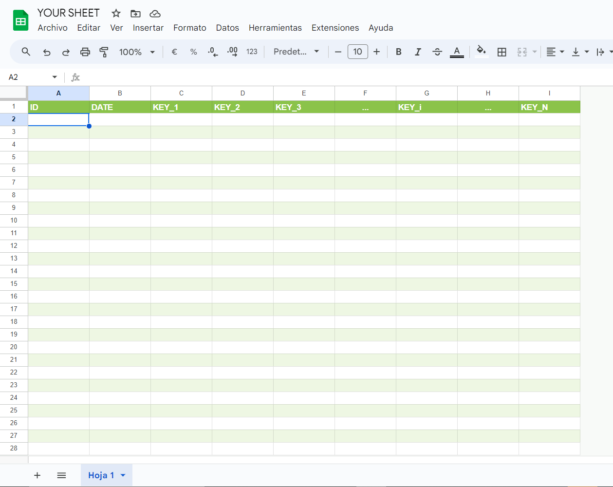

## Versión en Español

# 📊 Clase de CRUD para Google Apps Script con Google Sheets (v1.0.0)

¡Bienvenido a la **Clase de CRUD para Google Apps Script con Google Sheets**! Esta biblioteca facilita el uso de Google Sheets como bases de datos, permitiendo realizar operaciones **Crear, Leer, Actualizar** y **Eliminar** (CRUD) de manera sencilla. Ya sea que estés construyendo un CRM, un sistema de inventario o cualquier aplicación orientada a datos, esta librería te ayudará. ¡Empecemos! 🚀


## 🌟 Funcionalidades

- **✨ Operaciones CRUD**: Crea, lee, actualiza y elimina registros en Google Sheets sin complicaciones.
- **📜 Historial de Borrados**: Lleva un registro de las eliminaciones a través de tablas de historial.
- **🔍 Ordenamiento y Paginación**: Organiza y distribuye tus datos de manera efectiva.
- **✅ Validación de Tipos**: Asegura la integridad de los datos con verificación de tipos (`number`, `string`, `boolean`, `date`).
- **📦 **Nuevo** Manejo de Concurrencia**: Evita conflictos en operaciones simultáneas con bloqueos (locks) para lectura y escritura.
- **🔗 **Nuevo** Relaciones Muchos-a-Muchos**: Crea y gestiona tablas de relación (junction) para datos complejos.
- **⚡️ Caché Integrado**: Mejora el rendimiento con mecanismos de cache incorporados.
- **🎨 Esquemas de Colores**: Aplica temas de color predeterminados a tus hojas.

## 🎉 Novedades en la versión v1.0.0

1. **Manejo de Concurrencia**
  - **Bloqueo (Lock) para Crear/Actualizar/Eliminar** y así evitar que se sobreescriban datos por operaciones simultáneas.
  - Método nuevo:
    - `releaseLocks()`: Libera todos los bloqueos activos mantenidos por la instancia.

2. **Relaciones Muchos-a-Muchos**
  - Sencilla creación y gestión de **tablas de relación** (junction).
  - Métodos nuevos:
    - `createManyToManyTableConfig(config)`: Genera un objeto de configuración para una tabla de relación.
    - `createJunctionRecord(junctionTableName, data, keyOrder)`: Crea un registro en la tabla de relación, asegurando no duplicar la misma combinación.
    - `getJunctionRecords(junctionTableName, sourceTableName, targetTableName, sourceId, options)`: Obtiene datos relacionados a través de una tabla de relación.
    - `updateJunctionRecord(junctionTableName, id, data, keyOrder)`: Actualiza un registro existente en la tabla de relación.

3. **Eliminación en Cascada**
  - `removeWithCascade(tableName, historyTableName, id)`: Elimina un registro principal y, adicionalmente, sus referencias en tablas de relación.

4. **Lectura en Bloque (Bulk Read)**
  - `readIdList(tableName, ids)`: Lee varios registros a partir de una lista de IDs en una sola operación.

5. **Verificación de Integridad**
  - `checkTableIntegrity(junctionTableName, junctionHistoryTableName)`: Revisa la validez de llaves foráneas en tablas de relación y mueve los registros inválidos a la tabla de historial.

6. **Registros y Logs Detallados**
  - Métodos como `createWithLogs()` y `updateWithLogs()` ofrecen mayor visibilidad para depuración.

---

## 📦 Instalación

**Copia la clase encontrada en `CrudForSheets.js`** *(aún no he descubierto cómo compartir una biblioteca públicamente, cuando lo haga sigue los pasos a continuación)*

------------------------------------------------------------------------------------------------------------------------------------------
1. **Abrir el Editor de Google Apps Script**:
   - Ve a tus Google Sheets.
   - Haz clic en `Extensiones` > `Apps Script`.

2. **Agregar la Biblioteca**:
   - En el editor de Apps Script, haz clic en el ícono `+` junto a `Libraries`.
   - Ingresa el ID de la Biblioteca: `1flBjZa3u09YAgozp3H-GEhkxpl61rbB2QW2SKnV7ZVlRHNhgxZydegDG`.
   - Selecciona la última versión y agrégala a tu proyecto.

3. **Usar la Biblioteca**:
   - Ahora puedes usar la clase `DB` de la biblioteca para gestionar tus hojas de cálculo.

## 📚 Uso

### 🚀 Inicialización

Inicializa la base de datos creando una nueva instancia de la clase `DB`. Puedes crear una nueva hoja de cálculo o conectarte a una existente usando su ID.

```javascript
/**
 * Initialize the database.
 */

// Declare db in your global scope in order to use it in any part of the script
const db;
const existingDb;

function initializeDatabase() {
  // Initialize a new spreadsheet database
  db = DB.init('MyDatabase');

  // OR connect to an existing spreadsheet using its ID
  existingDb = DB.init('ExistingDatabase', 'YOUR_SPREADSHEET_ID');

  // Log the creation result
  console.log(db.getCreationResult());
}
```

### 🛠️ Creación de Tablas

Define y crea tablas dentro de tu hoja de cálculo. Cada tabla representa una hoja con campos y tipos especificados.

```javascript
/**
 * Create tables in the database.
 */
let tables = []
const db = DB.init('MyDatabase');
const employeeTableConfig;
const departmentTableConfig;

function createTables() {

  // Define configuration for the EMPLOYEES table
  employeeTableConfig = {
    tableName: "EMPLOYEES",
    historyTableName: "DELETED_EMPLOYEES",
    fields: {
      name: "string",
      age: "number",
      position: "string",
      employed: "boolean",
      hire_date: "date",
    }
  };

  // Create the EMPLOYEES table
  const createResult = db.createTable(employeeTableConfig);
  console.log("Employee table created:", createResult);

  // Define configuration for the DEPARTMENTS table
   departmentTableConfig = {
    tableName: "DEPARTMENTS",
    historyTableName: "DELETED_DEPARTMENTS",
    fields: {
      department_name: "string",
      manager_id: "number",
      location: "string",
    }
  };

  // Create the DEPARTMENTS table
  const deptCreateResult = db.createTable(departmentTableConfig);
  console.log("Departments table created:", deptCreateResult);

  tables.push(employeeTableConfig);
  tables.push(departmentTableConfig);
}
```

## Consideraciones Importantes para la Siguiente Sección

### 1. Serialización al llamar al backend
AppScript tiene un problema con la serialización, y como esta biblioteca intenta (pobremente) gestionar todos los campos con primitivas de JavaScript, cuando intentas recuperar algo del backend, por ejemplo una fecha, no pasará nada.

#### Ejemplo
Supongamos que tienes la siguiente tabla Order

```javascript
const orderTableConfig;

function initOrderTable(){
  orderTableConfig = {
    tableName: "ORDER",
    historyTableName: "DELETED_ORDER",
    fields : {
      transaction_id: "number",
      date_valid: "date",
      date_arrived: "date",
      completed: "boolean"
    }
  }

  db.createTable(orderTableConfig)
}

initOrderTable();
console.log(db.putTableIntoDbContext(orderTableConfig));
```

si quisieras obtener todos los registros de la tabla

```javascript
google.script.run
            .withFailureHandler((err)=>{
              Swal.fire("Ups!", "Something went wrong: err "+ err.message, "error")
            })
            .withSuccessHandler((response)=>{
              console.log(response)
            }).readStuffFromTable()
```

De hecho, no retornará nada. Imprimirá `null` o `undefined` en la consola. La razón es que el Motor de Serialización de Google Apps Script no sabe cómo manejar tipos `Date()` al retornarlos desde una llamada a función al archivo `.gs`.

#### La solución alternativa

Simplemente retorna todo usando `JSON.stringify(record)`, y deserialízalo en el cliente con `JSON.parse(record)`.

La función entonces se vería así:

```javascript
google.script.run
            .withFailureHandler((err)=>{
              Swal.fire("Ups!", "Something went wrong: err "+ err.message, "error")
            })
            .withSuccessHandler((response)=>{
              response = JSON.parse(response)
              console.log(response)
              // { code: 200, message: [all your data parsed]}
            }).readStuffFromTable()
```

Y sí, esto es *ineficiente*, es propenso a *errores* y si no capturas adecuadamente todas las excepciones que tu código lanza, prepárate para ver este clásico

```javascript
Uncaught SyntaxError: Unexpected token '}', "}" is not valid JSON
    at JSON.parse (<anonymous>)
    at <anonymous>:1:6
```

Pero bueno, ¿quién lo manda a usar `javascript`? Si querías seguridad de tipos, mejor gestión de errores y 0 sobrecarga en tu código, debiste haber haber aprendido un lenguaje **serio** como python,Go, C++ o ... **JAVA** (dijo nadie nunca).

#### Mi recomendación personal
Usar JavaScript es puramente un *skill issue*, **git gud**.

### 2. La forma en que se crean las tablas

Cada vez que la biblioteca crea tablas, automáticamente incluye dos columnas predeterminadas al inicio: **[ID, DATE]**. La biblioteca *espera* que cualquier tabla incluida en el contexto del esquema **también** comience con estas dos columnas en la hoja.

Entonces, *tu hoja* debería verse así:



#### ¿Por qué, preguntas?

Bueno, encontré que esos 2 campos son bastante útiles al usar cualquiera de las operaciones CRUD en cualquier tabla que estaba creando, así que los puse como las columnas predeterminadas en cada creación.

#### La parte importante ❗❗

Como esos campos son los predeterminados y son **esperados**, **NO** tienes que declararlos al crear los objetos *tableConfig*.

*tableConfig* incorrecto:
```javascript
orderTableConfig = {
    tableName: "ORDER",
    historyTableName: "DELETED_ORDER",
    fields : {
      id: "number", //no debería estar aquí
      date: "date", //no debería estar aquí
      transaction_id: "number",
      date_valid: "date",
      date_arrived: "date",
      completed: "boolean"
    }
  }
```

*tableConfig* esperado:
```javascript
orderTableConfig = {
    tableName: "ORDER",
    historyTableName: "DELETED_ORDER",
    fields : {
      transaction_id: "number",
      date_valid: "date",
      date_arrived: "date",
      completed: "boolean"
    }
  }
```

### 3. Cuidado con los Encabezados

Como se mencionó, la biblioteca espera que los campos **[ID, DATE]** sean las dos primeras columnas de cualquier tabla. Además, es importante que las tablas pasadas al contexto del esquema adhieran a las siguientes convenciones:

1. Los encabezados de columna deben estar en la primera fila de la hoja.
2. Todos los encabezados deben escribirse en **MAYÚSCULAS**.
3. Los encabezados deben usar **snake_case** para los nombres (por ejemplo, `date_valid`, `transaction_id`).
4. El objeto `fields` en `tableConfig` debe seguir el **mismo orden** que las columnas en la tabla.

Estas convenciones aseguran que todo funcione como se espera.

#### Mka yaa, ya entendí 😒


Sí, hay demasiadas consideraciones, *lo sé*, pero a medida que la biblioteca mejora, también lo hará su flexibilidad. Por favor, ten paciencia o mejor aún, ¡haz una pull request!

## ☝️🤓 En realidad... Hay 2 formas de hacer CRUD

Si decides crear las tablas desde la biblioteca, entonces puedes usar los objetos tableConfig para las operaciones CRUD.

Como esto

#### 1. Con objetos tableConfig
```javascript
db.create(tableConfig.tableName,
          newRecord,
          Object.keys(tableConfig.fields))
```
Si configuras las hojas tú mismo, también puedes usar las operaciones CRUD así

#### 2. Con constantes

```javascript
const tableName = "YOUR_TABLE_NAME";
const historyTableName = "DELETED_YOUR_TABLE_NAME";
const keyOrder = ["key1","key2", ...,"keyn"];

db.create(tableName,
          newRecord,
          keyOrder)
```

pero por el amor de Linus Torvalds, *PONLAS EN EL CONTEXTO DE LA DB* (o como diría el mensaje _schema_ 🧏‍♂️)

así que quedaría así

```javascript
//call create tables to create the sheets
createTables();
//call the function that puts table into context
putTablesInSchema();

function putTablesInSchema(){
  tables.forEach( table => {
    console.log(db.putTableIntoDbContext(table))
  })
}
```
Cuando las tablas están en el esquema de la DB, la biblioteca reconocerá cualquier operación CRUD ya sea que lo hagas como (1) o (2)

### ➕ Creación de Registros

Inserta nuevos registros en tus tablas. También puedes definir políticas para actualizar registros existentes basados en condiciones específicas.

Suponiendo que ya has inicializado la DB y tienes algunos registros:
```javascript
const db = DB.init('MyDatabase');

const employees = [
  {
    name: 'John Doe',
    age: 30,
    position: 'Software Engineer',
    employed: true,
    hire_date: new Date('2022-01-15')
  },
  {
    name: 'Jane Smith',
    age: 28,
    position: 'Product Manager',
    employed: true,
    hire_date: new Date('2021-11-05')
  },
];
```

1. Primero define una Función Wrapper
```javascript
function addEmployees(newEmployees) {
    // Method 1
   const result = db.create(employeeTableConfig.tableName,
                            newEmployees,
                            Object.keys(employeeTableConfig.fields));
   // Method 2
   const result = db.create('EMPLOYEES',
                           newEmployees,
                           ['name', 'age', 'position', 'employed', 'hire_date']);  
   console.log('Create Result:', result);
   return JSON.stringify(response)
}
```
2. Llama a la función cuando sea necesario
```javascript
google.script.run
            .withFailureHandler((err)=>{console.log(err.message)}
            .withSuccessHandler((response) => {
               response = JSON.parse(response)
               console.log(response)
            }).addEmployees(employees)   
```

### 🔍 Lectura de Registros

Recupera registros específicos o todos los registros de una tabla. Soporta ordenamiento y paginación para una gestión eficiente de datos.
(Si no deseas usar caché, no olvides desactivarlo).

```javascript
/**
 * Read all employees from the EMPLOYEES table.
 */
function readEmployees() {
  // Retrieve all employees, sorted by hire_date in descending order, 10 per page
  const employees = db.getAll('EMPLOYEES', { 
    page: 1, 
    pageSize: 10, 
    sortBy: 'hire_date', 
    sortOrder: 'desc' 
  }, false); // `false` to bypass cache

  // method 1
  const employees = db.getAll(employeeTableConfig.tableName, 
                              options={ 
                                page: 1, 
                                pageSize: 10, 
                                sortBy: 'hire_date', 
                                sortOrder: 'desc' 
                              },
                              useCache=false); // `false` to bypass cache

  console.log('Employees:', employees.data);
  return JSON.stringify(response);
}
```

### ✏️ Actualización de Registros

Modifica registros existentes en tus tablas basados en su ID único.

Supongamos que tienes un registro de empleado actualizado:

```javascript
const updatedEmployee = {
  name: 'John Doe',
  age: 31, // Edad actualizada
  position: 'Senior Software Engineer', // Posición actualizada
  employed: true,
  hire_date: new Date('2022-01-15')
};
```
1. (De nuevo) Define la función wrapper para la actualización
```javascript
/**
 * Update an employee's information.
 */
function updateEmployee(updatedEmployee) {
   //Method 1
  const updateResult = db.update(employeeTableConfig.tableName, updatedEmployee.id, updatedEmployee, Object.keys(employeeTableConfig.fields));
  console.log('Update Result:', updateResult);

   // Method 2
  const updateResult = db.update('EMPLOYEES', updatedEmployee.id, updatedEmployee, ['name', 'age', 'position', 'employed', 'hire_date']);

  return JSON.stringify(updateResult);
}
```

2. Llámala cuando sea necesario
```javascript
google.script.run
            .withFailureHandler((err)=>{console.log(err.message)}
            .withSuccessHandler((response) => {
               response = JSON.parse(response)
               console.log(response)
            }).updateEmployee(updatedEmployee)   
```

### 🗑️ Eliminación de Registros

Elimina registros de tus tablas. Los registros eliminados son *movidos* a una tabla de historial con fines de seguimiento.

1. Ya sabes el procedimiento
```javascript
/**
 * Delete an employee from the EMPLOYEES table.
 */
function deleteEmployee(id) {
  // Delete employee with ID 1 and move to DELETED_EMPLOYEES history table
  const deleteResult = db.remove('EMPLOYEES', 'DELETED_EMPLOYEES', id);

  //method 1
  const deleteResult = db.remove(employeeTableConfig.tableName, employeeTableConfig.historyTablename, id);
  console.log('Delete Result:', deleteResult);

  return JSON.stringify(deleteResult);
}
```

### **Nuevo**: Eliminación en Cascada

Para tablas relacionadas mediante “muchos-a-muchos” (junctions), puedes emplear:

```javascript
function deleteEmployeeCascade(id) {
  // Elimina al empleado y sus registros relacionados en las tablas de unión
  const deleteResult = db.removeWithCascade('EMPLOYEES', 'DELETED_EMPLOYEES', id);
  return JSON.stringify(deleteResult);
}
```

2. Llámala cuando sea necesario
```javascript
google.script.run
            .withFailureHandler((err)=>{console.log(err.message)}
            .withSuccessHandler((response) => {
               response = JSON.parse(response)
               console.log(response)
            }).deleteEmployee(4)
```

### 🎨 Aplicando Esquemas de Color

Mejora el atractivo visual de tus hojas aplicando temas de color predefinidos.

```javascript
const db = DB.init('MyDatabase');

/**
 * Apply a color scheme to the EMPLOYEES table.
 */
function applyColorScheme() {

  // Apply the 'blue' color scheme
  db.applyColorScheme('EMPLOYEES', 'blue');
  
  console.log('Color scheme applied to EMPLOYEES table.');
}
```

## 🔧 Ejemplos Avanzados

### 📈 Recuperación con Paginación y Ordenamiento

Recupera datos con opciones avanzadas como paginación y ordenamiento para manejar conjuntos de datos grandes de manera eficiente.

```javascript
const db = DB.init('MyDatabase');

/**
 * Fetch paginated and sorted employee data.
 */

function fetchPaginatedEmployees() {

  const options = {
    page: 2,          // Número de página
    pageSize: 5,      // Número de registros por página
    sortBy: 'age',    // Campo por el cual ordenar
    sortOrder: 'asc'  // Orden de clasificación: 'asc' o 'desc'
  };

  const result = db.getAll('EMPLOYEES', options, true); // `true` para usar caché
  console.log(result.data);
}
```

### 🛡️ Manejo de Validación de Tipos

Asegura la integridad de los datos validando los tipos de los datos entrantes antes de realizar operaciones.

```javascript
const db = DB.init('MyDatabase');

/**
 * Add an employee with type validation.
 */
function addEmployeeWithValidation() {

  const employee = {
    name: 'Alice Johnson',
    age: 'Thirty', // Tipo incorrecto: debería ser un número
    position: 'Designer',
    employed: true,
    hire_date: new Date('2023-03-10')
  };

  // esto fallará
  const result = db.create('EMPLOYEES', employee, ['name', 'age', 'position', 'employed', 'hire_date']);
  
  if (result.status === 500) {
    console.error('Failed to create employee:', result.error);
  } else {
    console.log('Employee created:', result);
  }
}
```
### 🔗 Relaciones Muchos-a-Muchos

Crea tablas de unión (junction) para modelar este tipo de relación, p.ej. `PROJECTS` <-> `EMPLOYEES`:

```javascript
// 1. Crea la configuración
const relationConfig = db.createManyToManyTableConfig({
  entity1TableName: "PROJECTS",
  entity2TableName: "EMPLOYEES",
  fieldsRelatedToBothEntities: {
    extra_field: "string" // opcional
  }
});

/*
 relationConfig.data => {
   tableName: "PROJECTS_EMPLOYEES_RELATION",
   historyTableName: "DELETED_PROJECTS_EMPLOYEES_RELATION",
   fields: { created_at: "date", projects_id: "number", employees_id: "number", ...}
 }
*/

// 2. Crea la tabla
db.createTable(relationConfig.data);
db.putTableIntoDbContext(relationConfig.data);

// 3. Inserta un registro en la tabla de relación
db.createJunctionRecord("PROJECTS_EMPLOYEES_RELATION", {
  projects_id: 10,
  employees_id: 5
}, ["projects_id", "employees_id"]);
```

### 🔎 Lectura en Bloque (Bulk Read)

Lee varios registros a la vez:

```javascript
function readManyEmployees() {
  // Pasa un array con los IDs
  const result = db.readIdList("EMPLOYEES", [1,2,3,100]);
  console.log(result.data);     // Registros encontrados
  console.log(result.notFound); // IDs que no se encontraron
  return JSON.stringify(result);
}
```

---

## 🔍 Documentación Detallada de Funciones

### `init(dbName, dbId)`
- **Descripción**: Crea o abre una base de datos de hoja de cálculo.
- **Parámetros**:
  - `dbName` *(string)*: El nombre de la base de datos.
  - `dbId` *(string, opcional)*: El ID de la hoja de cálculo de Google. Si no se proporciona, se crea una nueva hoja de cálculo.
- **Retorna**: Una instancia de la clase `DB`.

### `createTable(config)`
- **Descripción**: Crea una nueva tabla (hoja) en la hoja de cálculo.
- **Parámetros**:
  - `config` *(Object)*: Objeto de configuración para la tabla.
    - `tableName` *(string)*: Nombre de la tabla.
    - `historyTableName` *(string, opcional)*: Nombre de la tabla de historial para registros eliminados. Por defecto es `DELETED_<tableName>`.
    - `fields` *(Object)*: Pares clave-valor que definen los nombres de los campos y sus tipos.
      - **Tipos Soportados**: `boolean`, `string`, `date`, `number`
- **Retorna**: Objeto de estado con `status` y `message` o `error`.

### `create(tableName, data, keyOrder, addUpdatePolicy = null)`
- **Descripción**: Inserta un nuevo registro o actualiza uno existente basado en la política proporcionada.
- **Parámetros**:
  - `tableName` *(string)*: Nombre de la tabla.
  - `data` *(Object)*: Datos a insertar/actualizar.
  - `keyOrder` *(Array<string>)*: Orden de los campos.
  - `addUpdatePolicy` *(Object, opcional)*: Política para actualizar registros existentes.
    - `key` *(string)*: Campo para buscar registros existentes.
    - `value` *(any)*: Valor a coincidir para la clave.
- **Retorna**: Objeto de estado con `status`, `id` y `action` o `error`.

### `read(tableName, id)`
- **Descripción**: Recupera un registro por su ID.
- **Parámetros**:
  - `tableName` *(string)*: Nombre de la tabla.
  - `id` *(number|string)*: ID del registro.
- **Retorna**: Objeto de estado con `status` y `data` o `error`.

### `update(tableName, id, data, keyOrder, typesChecked = false, addUpdatePolicy = null)`
- **Descripción**: Actualiza un registro existente.
- **Parámetros**:
  - `tableName` *(string)*: Nombre de la tabla.
  - `id` *(number|string)*: ID del registro.
  - `data` *(Object)*: Nuevos datos para el registro.
  - `keyOrder` *(Array<string>)*: Orden de los campos.
  - `typesChecked` *(boolean, opcional)*: Si los tipos ya han sido validados.
  - `addUpdatePolicy` *(Object, opcional)*: Política para actualizaciones adicionales.
- **Retorna**: Objeto de estado con `status`, `id`, `data` y `action` o `error`.

### `remove(tableName, historyTableName, id)`
- **Descripción**: Elimina un registro y lo mueve a una tabla de historial.
- **Parámetros**:
  - `tableName` *(string)*: Nombre de la tabla.
  - `historyTableName` *(string)*: Nombre de la tabla de historial.
  - `id` *(number|string)*: ID del registro.
- **Retorna**: Objeto de estado con `status` y `message` o `error`.

### **Nuevo**: `removeWithCascade(tableName, historyTableName, id)`
Elimina un registro y, además, sus referencias en cualquier tabla de unión (junction).

- **Parámetros**:
  - `tableName` *(string)*
  - `historyTableName` *(string)*
  - `id` *(number|string)*
- **Retorna**: `{ status, message } | { status, error }`


### `getAll(tableName, options = {}, useCache = true)`
- **Descripción**: Recupera todos los registros con opciones opcionales de ordenamiento y paginación.
- **Parámetros**:
  - `tableName` *(string)*: Nombre de la tabla.
  - `options` *(Object, opcional)*:
    - `page` *(number)*: Número de página para la paginación.
    - `pageSize` *(number)*: Número de registros por página.
    - `sortBy` *(string)*: Campo por el cual ordenar.
    - `sortOrder` *(string)*: `'asc'` o `'desc'`.
  - `useCache` *(boolean, opcional)*: Si se debe usar datos en caché.
- **Retorna**: Objeto de estado con `status`, `data`, y `message` o `error`.

### `applyColorScheme(tableName, colorScheme)`
- **Descripción**: Aplica un esquema de color a una tabla para una mejor visualización.
- **Parámetros**:
  - `tableName` *(string)*: Nombre de la tabla.
  - `colorScheme` *(string)*: Esquema de color predefinido (`red`, `blue`, `green`, `orange`, `purple`).
- **Retorna**: Nada. Lanza un error si el esquema de color es inválido.

### Nuevo: **Relaciones Muchos-a-Muchos**

#### `createManyToManyTableConfig(config)`
Genera la configuración para una tabla de unión (junction).

- **Parámetros**:
  - `entity1TableName` *(string)*
  - `entity2TableName` *(string)*
  - `fieldsRelatedToBothEntities` *(Object, opcional)*
- **Retorna**: `{ status, data: { tableName, historyTableName, fields }, message } | { status, error }`

#### `createJunctionRecord(junctionTableName, data, keyOrder)`
Crea un nuevo registro en la tabla de unión, evitando duplicar la misma combinación de llaves.

- **Parámetros**:
  - `junctionTableName` *(string)*
  - `data` *(Object)*
  - `keyOrder` *(Array<string>)*
- **Retorna**: `{ status, id, action } | { status, error }`

#### `getJunctionRecords(junctionTableName, sourceTableName, targetTableName, sourceId, options)`
Obtiene registros relacionados a través de una tabla de unión.

- **Parámetros**:
  - `junctionTableName` *(string)*
  - `sourceTableName` *(string)*
  - `targetTableName` *(string)*
  - `sourceId` *(number)*
  - `options` *(Object)*: Ordenamiento/paginación.
- **Retorna**: `{ status, data: [...], message, metadata } | { status, error }`

#### `updateJunctionRecord(junctionTableName, id, data, keyOrder)`
Actualiza un registro en la tabla de unión, también evitando duplicados.

- **Parámetros**:
  - `junctionTableName` *(string)*
  - `id` *(number)*
  - `data` *(Object)*
  - `keyOrder` *(Array<string>)*
- **Retorna**: `{ status, id, data, action } | { status, error }`

#### `checkTableIntegrity(junctionTableName, junctionHistoryTableName)`
Valida referencias foráneas en una tabla de unión; mueve los inválidos a su tabla de historial.

- **Retorna**: `{ status, count, message } | { status, error }`

### **Bloqueos (Lock)**

#### `releaseLocks()`
Libera todos los bloqueos activos (tanto a nivel de script como de usuario) de la instancia `DB`.

---

## 📝 Caso de Uso de Ejemplo

Aquí se muestra cómo puedes integrar la clase `DB` en una aplicación web utilizando la función `doGet` de Google Apps Script.

```javascript
/**
 * Serve the web application.
 */
function doGet(e) {
  return HtmlService.createTemplateFromFile("index")
    .evaluate()
    .setTitle("Test_crud_app")
    .setFaviconUrl("YOUR_ICON")
    .addMetaTag('viewport', 'width=device-width, initial-scale=1')
    .setXFrameOptionsMode(HtmlService.XFrameOptionsMode.ALLOWALL);
}

/**
 * Include HTML files.
 */
function include(filename){
  return HtmlService.createHtmlOutputFromFile(filename).getContent();
}

// Initialize the database
const db = DB.init("SHEET_NAME", "YOUR_SHEET_ID");

// Define table configurations
const requestTableConfig = {
  tableName: "PQRS",
  historyTableName: "DELETED_PQRS",
  fields: {
    client_uuid: "string",
    applicant_type: "string",
    type: "string",
    class_t: "string",
    ot_number: "number",
    facts: "string",
    document_type: "string",
    document_number: "number",
    social_reason: "string",
    name: "string",
    last_name: "string",
    email: "string",
    phone: "number",
    email_comm: "boolean",
    wpp_comm: "boolean",
    department: "string",
    city: "string",
    address: "string",
    additional: "string",
    provider: "string",
    evidence_files_ids: "string",
    efficacy: "number",
    solved: "boolean",
    responsible: 'string',
    reason: 'string' 
  }
};

const actionTableConfig = {
  tableName: "ACTION_PLAN",
  historyTableName: "DELETED_ACTION_PLAN",
  fields: {
    pqrs_fk: "number",
    plan: "string",
    date_applied: "date",
    responsible: "string",
    state: "boolean",
    observations: "string",
  }
};

// Create the table OR
console.log(db.createTable(requestTableConfig));
console.log(db.createTable(actionTableConfig));

// Add tables to the database context
console.log(db.putTableIntoDbContext(requestTableConfig));
console.log(db.putTableIntoDbContext(actionTableConfig));


// Apply a color scheme to the ACTION_PLAN table
console.log(db.applyColorScheme(actionTableConfig.tableName, 'orange'));

/**
 * Read all records from the PQRS table.
 */
function readPqrsTable(){
  const response = db.getAll("PQRS", 
                              { /* options */ },
                              false); // Disable cache for fresh data
  Logger.log(response.message);
  console.log(response.data);
  return JSON.stringify(response);
}

/**
 * Update a record in the PQRS table.
 * @param {Object} newPqrs - The updated PQRS data.
 */
function updatePQRS(updatedPqrs){
  console.log(updatedPqrs);
  const response = db.update(requestTableConfig.tableName,
                            updatedPqrs.id,
                            updatedPqrs,
                            Object.keys(requestTableConfig.fields));
  Logger.log(response);
  return JSON.stringify(response);
}

/**
 * Read all records from the ACTION_PLAN table.
 */
function readActionPlanTable(){
  const response = db.getAll(actionTableConfig.tableName, 
                              { /* options */ },
                              false); // Disable cache for fresh data
  Logger.log(response.message);
  console.log(response.data);
  return JSON.stringify(response);
}

/**
 * Create a new Action Plan.
 * @param {Object} newActionPlan - The Action Plan data to create.
 */
function createActionPlan(newActionPlan){
  const response = db.create(actionTableConfig.tableName,
                      newActionPlan,
                      Object.keys(actionTableConfig.fields));
  Logger.log(response);
  return JSON.stringify(response);
}

/**
 * Delete an Action Plan by ID.
 * @param {number} id - The ID of the Action Plan to delete.
 */
function deleteActionPlan(id){
  const response = db.remove(actionTableConfig.tableName, actionTableConfig.historyTableName, id);
  Logger.log(response);
  return JSON.stringify(response);
}

/**
 * Update an existing Action Plan.
 * @param {Object} newActionPlan - The updated Action Plan data.
 */
function updateActionPlan(updatedActionPlan){
  console.log(updatedActionPlan);
  const response = db.update(actionTableConfig.tableName,
                            updatedActionPlan.id,
                            updatedActionPlan,
                            Object.keys(actionTableConfig.fields));
  Logger.log(response);
  return JSON.stringify(response);
}
```