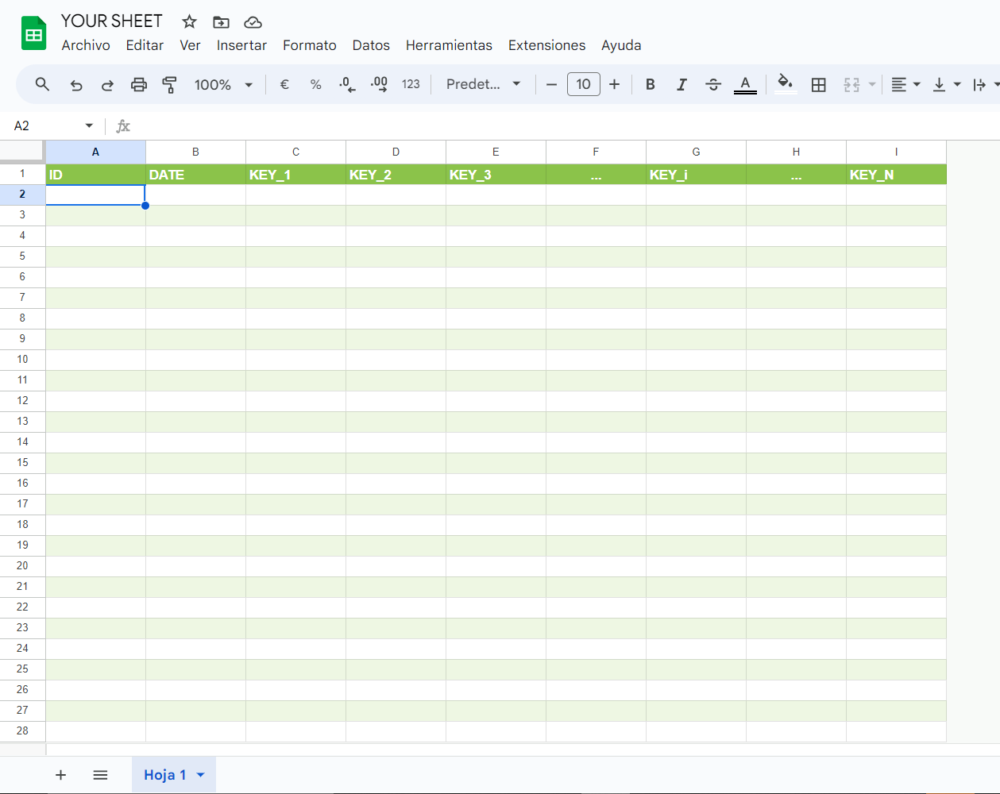

## Serialization problem when calling the backend
AppScript has a bit of a problem with serialization, and as this library attempts (poorly) to manage all the fields with js primitives, when you try to retrieve something from the backend, say a `Date`, it will not pass anything.

### Example
Let's say you have the following `Order table`

```javascript
const orderTableConfig;

function initOrderTable(){
  orderTableConfig = {
    tableName: "ORDER",
    historyTableName: "DELETED_ORDER",
    fields : {
      transaction_id: "number",
      date_valid: "date",
      date_arrived: "date",
      completed: "boolean"
    }
  }

  db.createTable(orderTableConfig)
}

initOrderTable();
console.log(db.putTableIntoDbContext(orderTableConfig));

```

**If you wanted to get all the records of the table** you would do something like this:

```javascript

google.script.run
            .withFailureHandler((err)=>{
              Swal.fire("Ups!", "Something went wrong: err "+ err.message, "error")
            })
            .withSuccessHandler((response)=>{
              console.log(response)
            }).readStuffFromTable()

```

In fact, it wont return anything. It will print out `null` or `undefined` in the console. The reason being that the GoogleAppsScript Serialization Engine doesn't know how to handle `Date()` types when returning them from a function call to the `.gs` file.

### The Workaround

Just return everything over a `JSON.stringify(record)`, and the de-serialize it in the client `JSON.parse(record)`.

The function then would look like this:

```javascript
google.script.run
            .withFailureHandler((err)=>{
              Swal.fire("Ups!", "Something went wrong: err "+ err.message, "error")
            })
            .withSuccessHandler((response)=>{
              response = JSON.parse(response)
              console.log(response)
              // { code: 200, message: [all yout data parsed]}
            }).readStuffFromTable()

```

And yes this is **inefficient**, it's prone to *errors* and if don't properly catch all the exceptions that your code throws, prepare to be seing this all time classic

```javascript
Uncaught SyntaxError: Unexpected token '}', "}" is not valid JSON
    at JSON.parse (<anonymous>)
    at <anonymous>:1:6
```
But hey, who did told you to use `javascript`? if you wanted type-safety, better error management and 0 bloat in your code, you should have known better.

### My personal recomendation
Using javascript is purely a skill issue, *git gud*.

## 2. The way the tables are created

Whenever the library creates tables, it automatically includes two default columns at the beginning: **[ID, DATE]**. The library *expects* that any table included in the schema context **also** begins with these two columns in the sheet.

So, *your sheet* should look like this:



### Why, you ask?

Well, i found those 2 fields to be pretty useful when using any of the CRUD operations on any table i was making, so i just put them as the default columns on every creation.

### The important Bit ❗❗

As those fields are the default and are **expected** you **DO NOT** have to declare them when creating the *tableConfig* objects. 

Bad *tableConfig*:
```javascript
orderTableConfig = {
    tableName: "ORDER",
    historyTableName: "DELETED_ORDER",
    fields : {
      id: "number", //shouldn't be here
      date: "date", //shouldn't be here
      transaction_id: "number",
      date_valid: "date",
      date_arrived: "date",
      completed: "boolean"
    }
  }

```

Expected *tableConfig*
```javascript
orderTableConfig = {
    tableName: "ORDER",
    historyTableName: "DELETED_ORDER",
    fields : {
      transaction_id: "number",
      date_valid: "date",
      date_arrived: "date",
      completed: "boolean"
    }
  }

```

## 3. Beware of the SCREAMING_SNAKE_CASE_HEADERS

As mentioned, the library expects the **[ID, DATE]** fields to be the first two columns of any table. Additionally, it is important that the tables passed to the schema context adhere to the following conventions:

1. The column headers must be in the first row of the sheet.
2. All headers should be written in **ALL_CAPS**.
3. Headers should use **snake_case** for naming (e.g., `date_valid`, `transaction_id`).
4. The `fields` object in `tableConfig` should follow the **same order** as the columns in the table.

These conventions ensure work as expected.

## Okay Sergeant Buzzkill, i got it 😒


Yes, there are too many caveats, *i know*, but as the library improves, so will it's flexibility. Please be patient or better yet, make a pull request!

